# Work In Progress !

Table of Contents
=================

  * [Openstack and cloud native application](#openstack-and-cloud-native-application)
    * [Lab Writer and Trainer](#lab-writer-and-trainer)
    * [Prerequisites](#prerequisites)
    * [Objectives of Lab](#objectives-of-lab)
    * [Reference documents](#reference-documents)
  * [The infrastructure driven API (part 1)](#the-infrastructure-driven-api-part-1)
    * [2 words about Openstack](#2-words-about-openstack)
    * [Lab environment description](#lab-environment-description)
    * [Stop talking, get our hands dirty !](#stop-talking-get-our-hands-dirty-)
      * [Minimal checks of the platform](#minimal-checks-of-the-platform)
      * [Deploy using python script and cli](#deploy-using-python-script-and-cli)
      * [Deploy a bastion waystation](#deploy-a-bastion-waystation)
      * [Deploy Prestashop](#deploy-prestashop)
        * [Configure Ansible to use server names](#configure-Ansible-to-use-server-names)
        * [Heat first template](#heat-first-template)


# Openstack and cloud native application

This lab is in 2 parts:
  1. The infrastructure driven API.
  2. Create your cloud native application.

* The goal of the first part is automate infrastructure deployments and changes (Infrastructure as code concept). Within this part we are using Openstack as our Infrastructure As A Service platform but this is an implementation choice. The same principles can be implemented on top of another platform like Eucalyptus, Cloudstack, Amazon AWS, Azure.

* The goal of the second part is to create a cloud native application and to explain the concepts around that. All of this is completely platform agnostic. Of course in our case, we will do it on top of Openstack.

Both parts are independent and can be followed in any order. However, people coming from operational (ops) world will be probably more familiar with the first part. Contrary to people coming from the development (dev) world that should be more familiar with the second one.

Expected duration for each part is : 240 minutes.


## Lab Writer and Trainer
  - Bruno.Cornec@hpe.com
  - Rene.Ribaud@hpe.com

## Prerequisites

In order to follow this lab, you need to :

Part one :
* Be familiar with Linux.
* Have knowledge with IAAS and Openstack (follow our colleagues Openstack training).
* Have a few network knowledge.

Part two :
* Be familiar with Linux.
* Have knowledge with IAAS and Openstack.
* Some knowledge in the development world.

## Objectives of Lab
At the end of the Lab part one, students should be able to understand automation concept and be able to do their own automation scenario.

At the end of the Lab part two, students should be able to understand cloud native application concepts and be able to explain/apply some of them in their day to day job.

This Lab is intended to be trial and error so that during the session students should understand really what is behind the tools and concept, instead of blindly following instructions, which never teach people anything IMHO. You've been warned ;-)


## Reference documents

TBD

Estimated time for the lab is placed in front of each part.


# The infrastructure driven API (part 1)


## 2 words about Openstack

Openstack is a cloud solution to implement Infrastructure As A Service solution.

Key strengths :

* Drivers allow abstraction of the underlying physical infrastructure. Example, the way to create a persistent volume will be the same whatever the physical storage used (HPE, EMC, etc...).

* Standard defined API will allow automation whatever the tool/languages used.

* Opensource, all pieces of code can be used, studied, modified, copied as defined by the open source freedoms.

## Lab environment description

Openstack suppliers (HPE, Redhat, Mirantis, etc...) will bundle Openstack upstream projects and create an Openstack distribution.

The one used in our lab is devstack, this is a "distribution" intended to develop Openstack. We chose to deploy it on a single baremetal node.

Here is the lab environment:
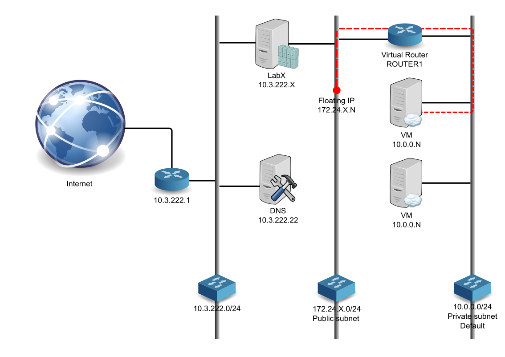

* X stand for group number.

* N is a number assigned from Openstack dhcp.

* 10.0.0.0/24 is our initial cloud internal network, VM will be deployed on it. We will use this subnet as our management subnet to deal with our infrastructure. The default security group will be attached to the VM inside this subnet. For convenience, icmp(ping) and ssh will be opened. 

* 172.24.X.0/24 is our external cloud network. So it means, if you want to access a VM from outside of your cloud, you will have to create a floating ip to your VM. This is the mechanism used by Openstack default model (using neutron/vxlan) to map internal subnet defined by cloud users to datacenter network provided by IT network administrators. In a real world, this network would be known as a datacenter network, so it could be reached from "anywhere". In our case, this subnet can only be reached from LabX system. (need to explain access from internet)

* 10.3.222.0/24 is the datacenter network connecting our systems LabX and DNS.

* LabX is Openstack devstack and act as controller, compute, storage node. The Openstack services provided are Keystone, Horizon, Nova, Glance, Cinder, Neutron, Swift and Heat. You will also connect to this node and work from it.
	* Horizon is available at http://10.3.222.X/dashboard
	* Keystone endpoint is http://10.3.222.X:5000/v2.0
	* Login = admin or demo, password = password


* 10.3.222.22 can be used as a DNS server.


## Stop talking, get our hands dirty !

### Minimal checks of the platform

1. Connect to the horizon console.
2. Deploy a "myinstance" cirros tiny instance using your lab station ssh key.
3. Create a floating ip associated to your instance.
4. Connect  to your instance using ssh and keys (login: cirros).
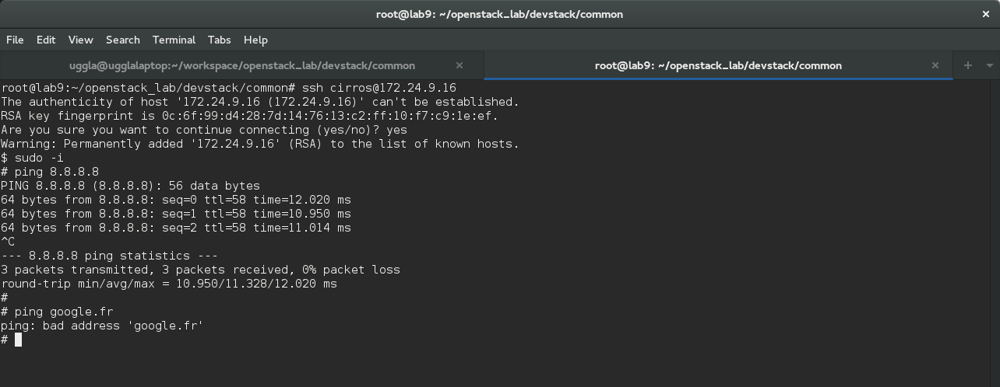
5. Check if you can ping an internet ip address (8.8.8.8), try with a fqdn (google.fr). Something should be wrong here, try to permanently fix that issue, and follow next steps to validate it. (hint update nw settings).


Ok, we should now have internet available on our deployed instances. Let's continue and verify our fix is working fine.

### Deploy using python script and cli

We used horizon to deploy our first instance, this is cool, but it's still needs human intervention to do that.
However horizon is using the API and it is doing API calls in the background to the Openstack REST API.

So as an example, we will use a python script that will do the same things we did manually. The script will use python modules to interact with the REST API.

1. Connect to your lab controller using ssh.
2. Jump into the openstack_lab/devstack/common directory.
3. Edit `boot_cirros.py` file and change the line `auth_url = "http://192.168.27.100:35357/v2.0"` to point to your own endpoint.
4. Execute the script:
 python ./boot_cirros.py

5. Check the result on the horizon console. Quite cool isn't it ?
6. Connect  to your new instance using ssh and keys.
7. **Check if you can resolv internet addresses. If not, you failed in fixing the above issue and you just need to do it again or call the trainer if you are stuck.**

Well, we manage to drive our infrastructure using a python script, so it means we can do it from an application this is really powerful ! But, maybe you don't know about python (which is bad ;) ) . This is not an issue, bindings exists for other languages and of course applications have been developed to use that.


As an application example, we're going to do the same using the cli:
1. From controller, source our credentials and variables to access Openstack
 cd ~/openstack_lab/devstack/baremetal/
 source demo.openrc
2. You can see the variables defined using:
 env | grep OS
3. Go back into ~/openstack_lab/devstack/common and `cat boot_cirros.sh`.
4. Execute that script

As a result, we have a new instance called cirros-script running with a floating ip.

We can see the usage of 2 cli tools nova and openstack. Nova, cinder, glance, ..., tools are the old cli commands. The new way of managing Openstack is to use the `openstack` command. Because of this tool freshness, the latest command might not cover all the features compared to the old set of tools. So currently, we may have to use both.

### Deploy a bastion waystation

All the VM deployed on the private network cannot be reached from outside, unless a floating ip have been configured.

In order to make our automation easier not mapping/unmapping floating ip, we will deploy a bastion waystation that will relay ssh to the internal networks. This is also more secured, because we will expose from the outside of our cloud only the VMs that really require external access.

1. Jump into ~/openstack_lab/bastion
2. Launch `./bastion.sh`, it will deploy our bastion waystation attached to a floating ip.
3. Launch `./insternalvm.sh`, it will deploy a VM on private network only. Note : these are debian instances, so login: debian.
4. Connect first to the bastion waystation, then to the VM on the private network. You may experience some issue connecting to the VM on the private network.
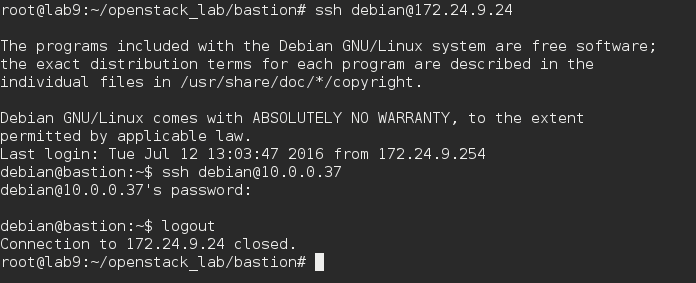
5. The issue is due to ssh agent forwarding not loaded and default settings.
6. Load ssh-agent `eval $(ssh-agent)` and add key `ssh-add`.
7. Change the `/etc/ssh/ssh_config` setting to `ForwardAgent yes`.
8. Try to connect again, this should now work.
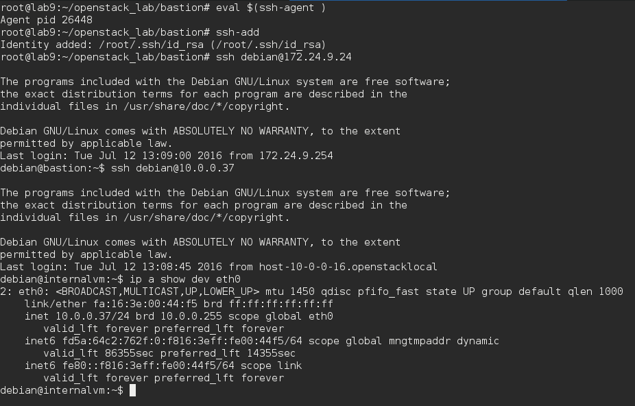

At that point, we can join our VM located on the private network, we will now configure the ssh proxy command. So we will be able to use ssh as usual and it will proxy our connection to the bastion host in the background.

1. To not use the proxy all the time, we will create a dedicated ssh_config client configuration. Copy your existing ssh_config: `cp /etc/ssh/ssh_config .`
2. Edit the local ssh_config file changing ProxyCommand to `ProxyCommand ssh -q -W %h:%p debian@bastion` and add a bastion entry in your /etc/hosts.
3. Try to connect directly to the VM on the internal subnet: `ssh -v -F ssh_config debian@10.0.0.37`, here we will use `-v` to show some debug message ensuring we are going through the proxy.
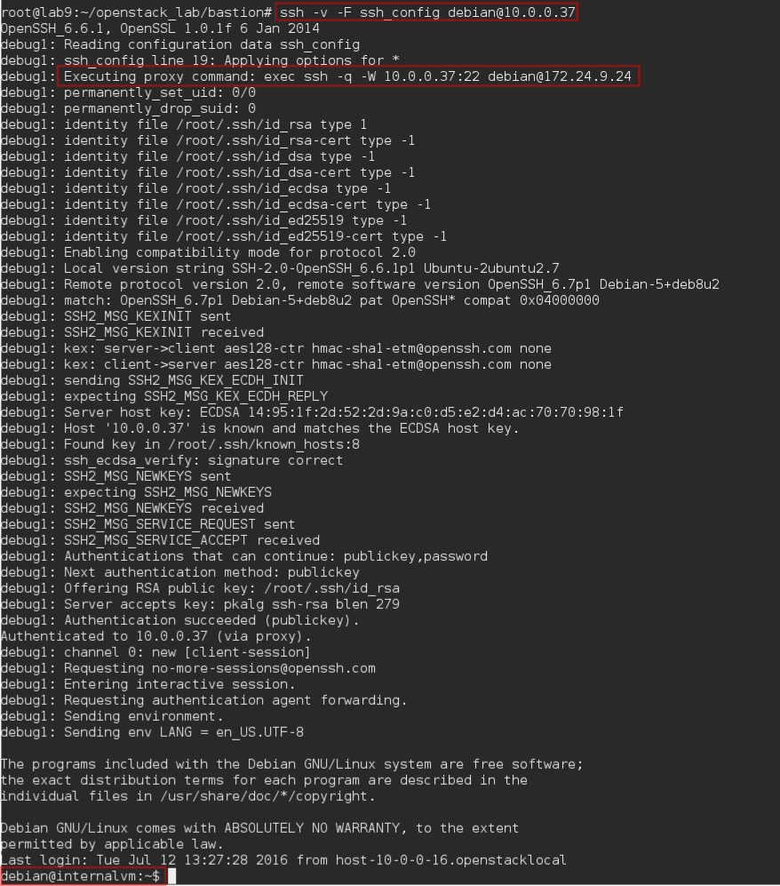


### Deploy Prestashop

We will now deploy an application, we will use Prestashop as an example. This is a php/mysql application.

We will deploy the following infrastructure:

* 1 x network to host our servers.
* 1 x security group associated that will allow ssh from private network to the Prestashop one and http from outside.
* 1 x server apache + php engine, Debian based.
* 1 x server mysql database, Centos based.
* 1 x floating ip to the server.

Of course we could use a lot of tools to deploy our application (bash script, puppet, HPOO, cloudslang). Here we will choose:
* Heat, Openstack orchestration service to deploy the "infrastructure".
* Ansible, configuration management tool, to configure our servers according to our policies (packages, configuration files, ...).

Again, this is an implementation choice to show you 2 different tools. But combining those tools make sens and make the deployment convenient. (this is also because the author likes them ! ;) )

#### Configure Ansible to use server names

Cloud instances are really easy to spawn. However each time you spawn an instance, the ip is changing.
So it is really difficult to rely on ip. We need to use names.

Ansible use a file to called inventory to describe nodes. Then the playbooks, which will be our recipe to configure hosts will use the inventory file. Although in such case, this is static inventory.

But, Ansible can also use a feature called dynamic inventory, an external provider can be configured to supply the host list and ip. Guess what ? A script is proposed on the Ansible [website](http://docs.Ansible.com/ansible/intro_dynamic_inventory.html#example-openstack-external-inventory-script) to integrate it with Openstack.

We are going to configure that mechanism:

1. Jump into ~/openstack_lab/ansible
2. Within this directory, you will find openstack.py script. Execute it `./openstack.py --list`. The output is a json file generated from Openstack containing information about our cloud and Ansible can use that.
3. invpriv.sh and invpub.sh are wrappers around openstack.py to select between a inventory based on private or public adresses. We will use the private one and our ssh proxy to connect using names to our desired instances.
4. We will configure Ansible to use all of that. First, we will use our own ansible.cfg configuration file. This file is already available in the directory. We will edit it and modify the following settings:
* `inventory      = ~/openstack_lab/ansible/invpriv.sh` this will tell Ansible to use our wrapper script to generate the dynamic inventory.
* `remote_user = debian` as most of our instances will be Debian, we use debian as default remote user.
* `log_path = /var/log/ansible.log` enable Ansible logging which is usually a good habit.
* `ssh_args = -F /root/openstack_lab/ansible/ssh_config` will tell Ansible to use our own ssh_config, configured to use our bastion proxy host. Note: the full path of the configuration file must be used.
5. If everything is fine, running `ansible -vvvv internalvm -m ping` should produce the following output.
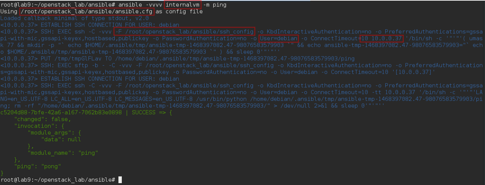

Ok we are ready to go ahead with automation using Ansible !

#### Heat first templates

As explained above, we will use Heat to deploy our infrastructure.

1. Jump into ~/openstack_lab/heat.
2. Read hello_world.sh content and then run it `./hello_world.sh`, this script will use the hello_world.yaml Heat template to deploy a simple server called hellostack_server1.
3. Try to craft an openstack command line to use the servers_in_existing_neutron_net.yaml which is more interesting. The goal is to understand parameters first and then resources. As a result, you should have a stack and a network topology looking like the following ones.
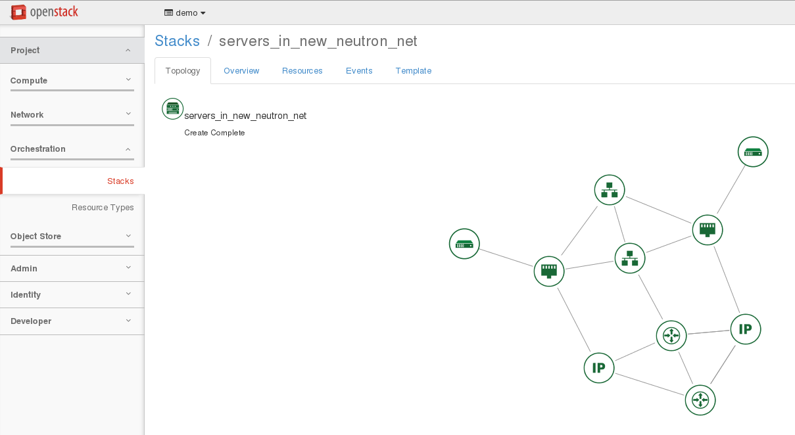

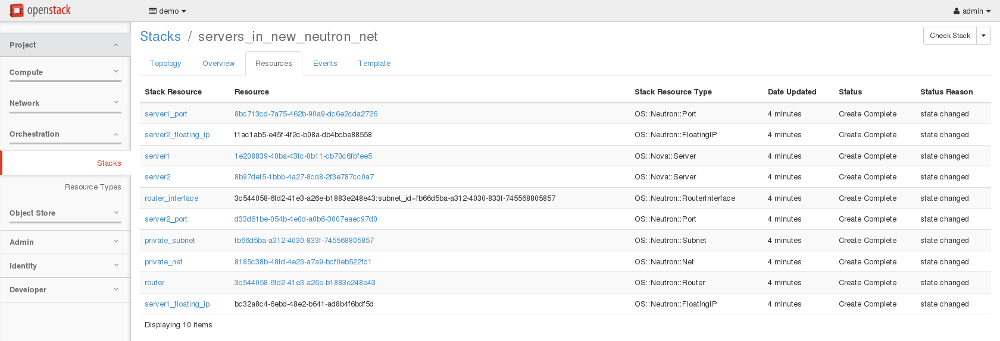

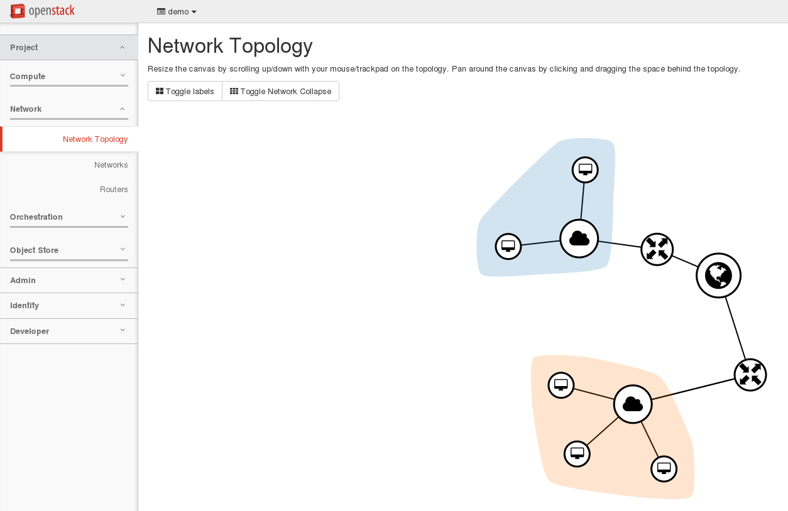


#### Heat Prestashop template

Now we can try to elaborate our template.

1. Delete the 2 previous stacks `openstack stack delete hellostack` and `openstack stack delete  servers_in_new_neutron_net`.
2. Based on servers_in_existing_neutron_net.yaml and servers_in_new_neutron_net.yaml templates, try to mix these templates in order to create a new one that fulfill Prestashop infrastructure needs.
    * Do not create a new router, just attach to the existing router1.
    * Take care with flavor and images because db and web should not run the same distribution.
    * Manage security group to allow :
        * ssh and icmp connections from default security group.
        * mysql traffic within the deployed security group.
        * web access from outside.
        * Outputs should contain the private and public ips.

Note: Information about resources can be found into horizon:
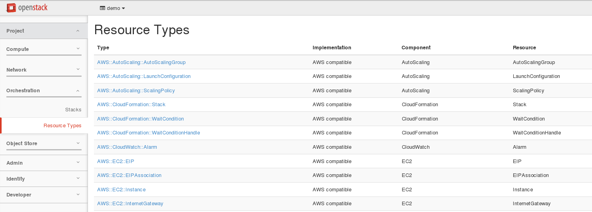

3. If you manage to meet the above settings, you should have something similar to servers_in_existing_neutron_net.yaml as a template.
4. The servers_in_existing_neutron_net.yaml template has been wrapped into prestashop_v1.sh script, so you can deploy a prestashop infra stack using `./prestashop_v1.sh <private_nw_subnet> <stackname>`

#### Prestashop configuration with Ansible

1. Jump to ~/openstack_lab/ansible/prestashop.

There are 2 playbooks in this directory.
    * prestashop_infra_v1.yaml
    * prestashop_app_v1.yaml

*  prestashop_infra_v1.yaml is doing:
    * 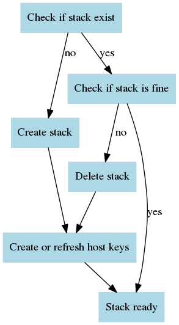

* prestashop_app_v1.yaml will use 2 roles:
    * ~/openstack_lab/ansible/roles/v1/web --> will configure prestashop.
    * ~/openstack_lab/ansible/roles/v1/db  --> will configure mysql + phpmyadmin.


The both templates have been wrapped into prestashop_v1.sh script. So you can deploy the prestashop application using `./prestashop_v1.sh <private_nw_subnet> <stackname>`.

Covering these playbooks and roles in the lab will be a bit too complex especially if you don't know Ansible. So we will use this materials has a common starting base, and we will elaborate it to have a smoother Ansible introduction.

2. Deploy the application following above specification.

##### Prestashop part
1. Get the public_ip from openstack.
2. Configure dnat to reach the ip from "outside".`iptables -t nat -A PREROUTING --dst <host_ip> -p tcp --dport 60080 -j DNAT --to-destination <public_ip>:80` *(to be reviewed with pub ip provided by Bruno but template must be changed in that case to fix the floating ip)*
3. Connect to the application using your browser, you should see this screen:
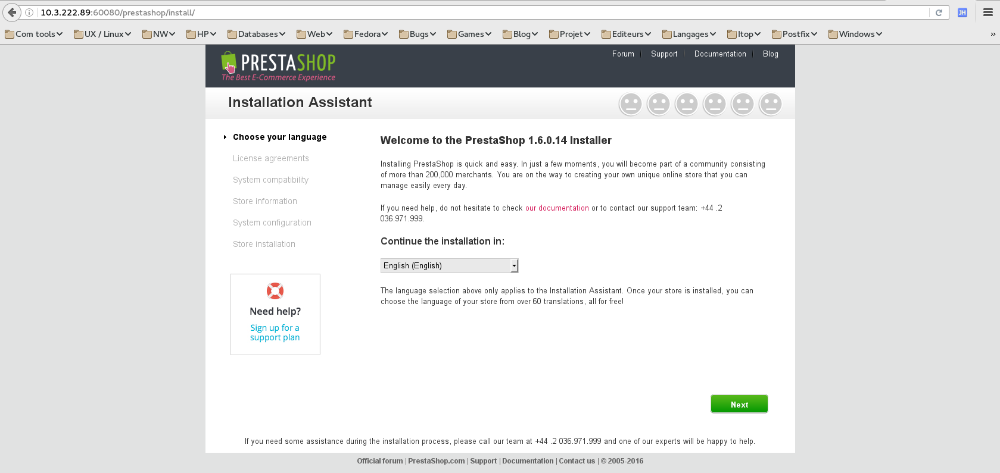
4. Continue with the application configuration.
  * 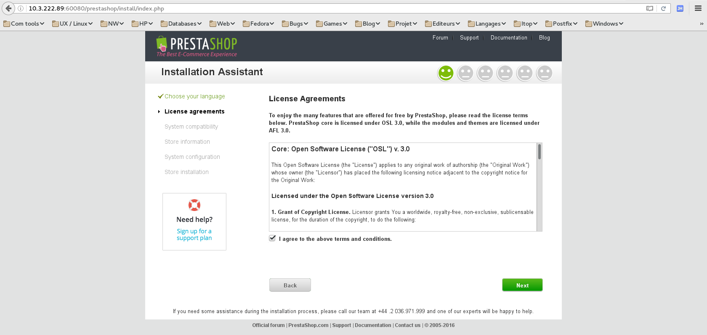
  * 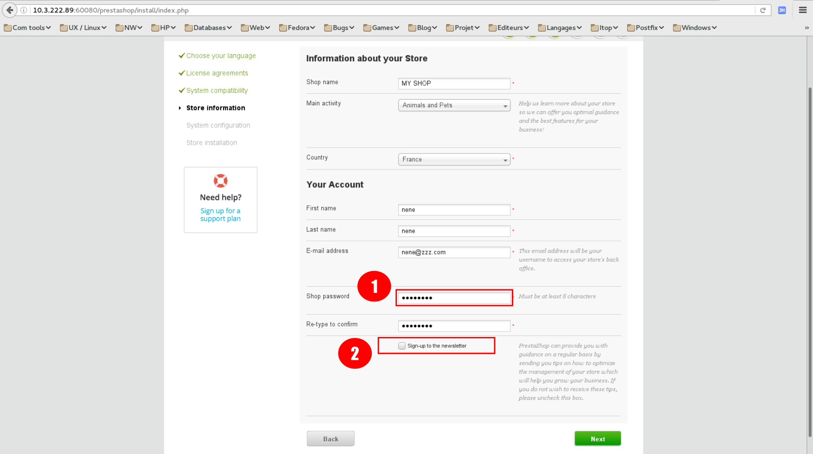
    1. Enter password and wrote it.
    2. Uncheck "Sign-up to newsletter".
    3. Enter an email and wrote it (do not enter your personal one). This will be used to access the admin part of the site.
  * 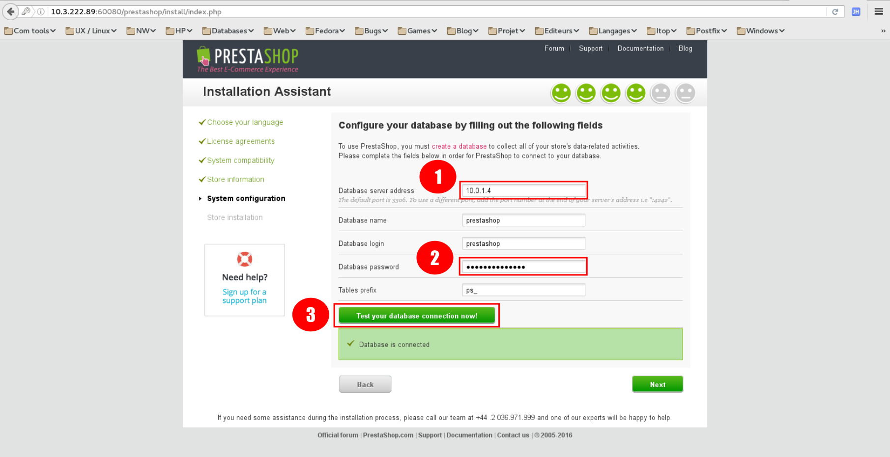
    1. Enter the ip address of your database.
    2. Database password is `prestashop1234`.
    3. Test connection to the db.
  * 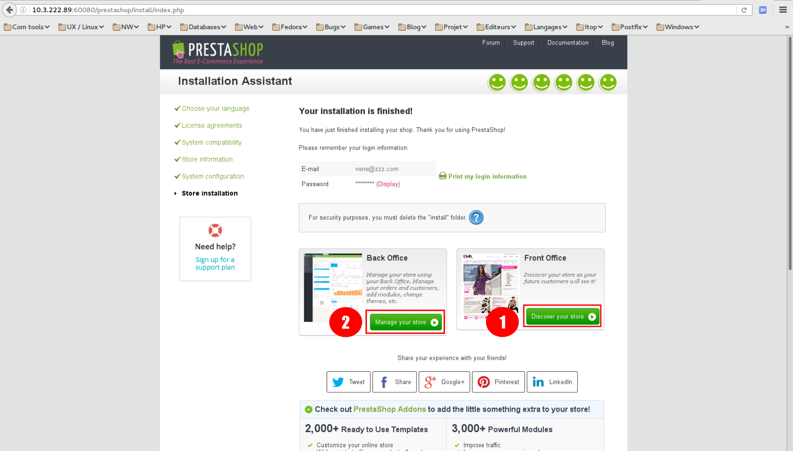
    1. Click to show the site main page.
    2. Click to show the admin part.
  * 
  * 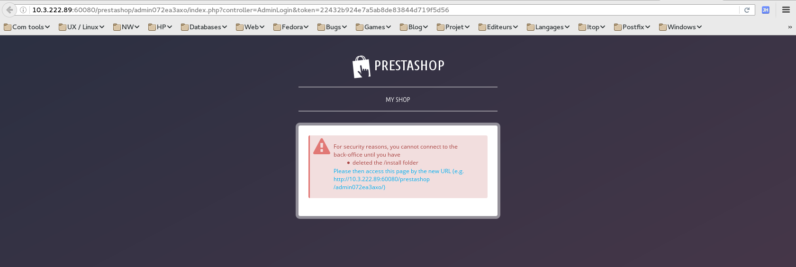
    1. This is a security feature, a file must be removed to access that part.
    2. Connect to the web instance with ssh, try to connect through the public ip first. Why is it not working ?
    3. Remove the install directory. `sudo rm -rf /var/www/html/prestashop/install`
  * 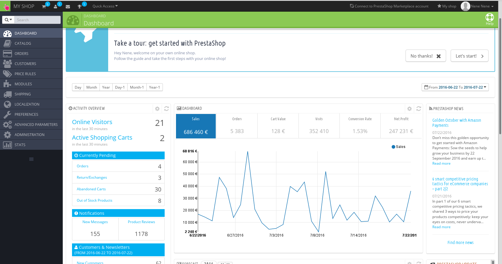

Ok, this is fine but not completely automatic. It will be great to have our Prestashop site ready to use. Basically the status we have currently. However to do that, there is some things we need to fix.
1. We need to know the ip address of the web service. This can be retrieve from Heat output, but as usual using ip with cloud environment is not really easy.
2. If we look at the Prestashop installation, it is doing 2 main things:
    1. Creating the configuration file that mainly specify how to access the database.
    2. Populating the database with the application required tables and settings.

Before fixing those points, we will have a look to another part to play a little with Ansible.


##### Phpmyadmin part

As explained above, the database instance was deployed with phpmyadmin. This is a web application to manage the database.

To reach the application we need to connect using a navigator to the database instance. As we don't have a floating ip, we cannot connect to it from outside, but we can use a ssh tunnel to do that.

1. Connect to the database instance and open a tunnel `ssh -F ../ssh_config -L 60000:localhost:80 -g centos@10.0.1.4`
2. Try to connect using a navigator and address `localhost:60000`. Why is it not working ?
3. Right the service httpd is down, start it and you should get the CentOS default web pages.
4. If you use `localhost:60000/phpmyadmin`, you can see the phpMyAdmin login screen.
5. So the service is not started at the end of our db role, try to fix it. You can restart the `prestashop_v1.sh` script as many times as you wish. This is one of the value of Ansible, it helps to do idempotent scripts. Call the instructor if you are stuck ot if you need explanations.

##### Using names for our services

Back to our automation issue, we will now fix the naming problems.

To do that we will install a register service, we will use the Consul application.

Consul is a nice application, we can register names using rest API calls. The names can be retrieve using rest queries, but Consul is also compatible with the DNS protocol so it can be queried using standard dns tools.

You will create your first ansible playbook, this playbook will do :
* Deploy using Heat a new debian instance in a new network. Opening port 53 (DNS) from anywhere, 8500 (API + UI) from default. It means API will not be accessible publicly.
* Download consul zip from https://releases.hashicorp.com/consul/0.6.4/consul_0.6.4_linux_amd64.zip .
* Extract consul in /usr/local/bin.
* Create a systemd service file for consul.
* Create a configuration file to set dns port from 8000 (default consul port) to 53.
* Execute it in development mode, also activate the ui (web interface) option. It will be run as root.

Of course this is to make our consul installation as simple as possible, this is not suitable for a real production usage. For production, we will have to create a cluster, run it with a system account (not root) and use dnsmasq or a firewall rule to redirect traffic form port 53 to default consul one (8600).

1. Create a new **heat template**, by copying the prestashop one.
```
cd ~/openstack_lab/heat
cp prestashop_v1.sh myconsul_v1.sh
cp prestashop_v1.yaml myconsul_v1.yaml
cp prestashop_v1_param.yaml myconsul_v1_param.yaml
```
2. Adapt those files to meet the above requirements.
3. Create a new **ansible playbook**, by copying the prestashop one.
```
cd ~/openstack_lab/ansible/consul
cp ../ansible/*v1* .
mv prestashop_v1.sh myconsul.sh
mv prestashop_infra_v1.yaml myconsul_infra.yaml
mv prestashop_app_v1.yaml myconsul_app.yaml
```
4. Adapt the `myconsul*` files:
  * Update the host specifying "{{ stackname }}-consul".
  * Update the variable sections then the task sections.
  * Configuration file and systemd configuration file template are located under the template directory.

If you are stuck, you can call the trainer or look at `consul*` files as an example.
5. Deploy your consul.
6. Try to connect on your consul server using the ui.
7. You can use the command in query.txt to register a service and verify with the ui.
8. Test that consul is working fine using dig. `dig @127.0.0.1 -p 8600 consul.service.consul` and `dig @127.0.0.1 -p 8600 redis2.service.consul`
